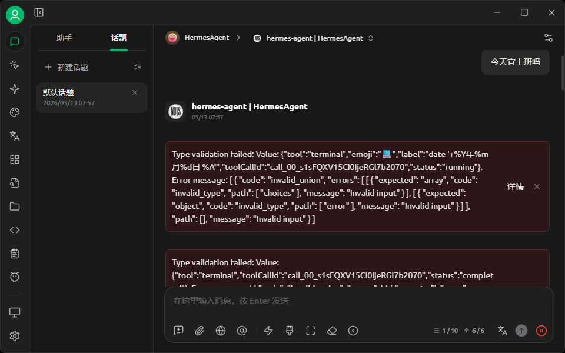
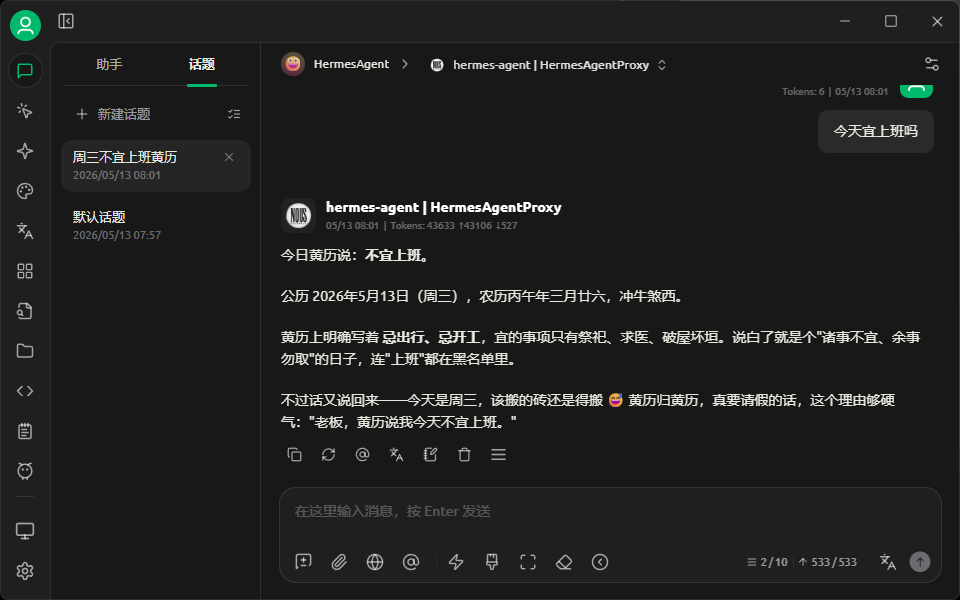

# HermesApiProxy

一个脚本解决 Hermes Agent 与 Cherry Studio 的兼容问题

报错: `Type validation failed: Value: {...}`

before proxy



after proxy



### Usage

- 修改脚本 `hermes_api_proxy.py` 里的变量, 替换为你自己的
  - `HERMES`: 服务器地址, 一般是 `http://localhost:8642`
  - `API_KEY`: 你 Hermes Agent 的 `API_KEY`

- 执行脚本

  ```shell
  # 1. 安装 venv（如果没有）
  apt update
  apt install -y python3-venv
  
  # 2. 创建虚拟环境
  python3 -m venv ~/hermes-api-proxy-venv
  
  # 3. 激活
  source ~/hermes-api-proxy-venv/bin/activate
  
  # 4. 安装依赖
  pip install fastapi uvicorn httpx
  
  # 5. 开启代理, 代理地址为: http://localhost:8000/v1
  source ~/hermes-api-proxy-venv/bin/activate
  uvicorn hermes_api_proxy:app --host 0.0.0.0 --port 8000
  
  # 或
  ~/hermes-api-proxy-venv/bin/python -m uvicorn hermes_api_proxy:app --host 0.0.0.0 --port 8000
  ```

- 在客户端 Cherry Studio 使用代理地址和模型（这些值都可以自己去修改）
  - `BASE_URL`: `http://localhost:8000/v1`
  - `API_KEY`: empty, 空
  - `model`: `hermes-agent`

- [可选] 设置自启动, 可以利用 `systemd` 或 `crontab`
